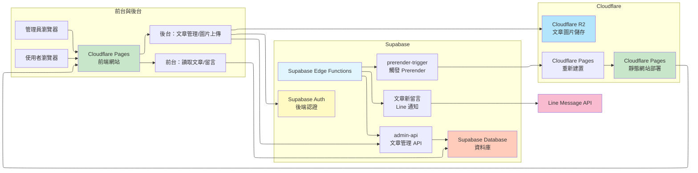

## 專案介紹

使用 **React + Vite + TypeScript** 建立的個人作品展示網站與部落格，搭配 **Supabase** 作為後端服務（Edge Function）與資料庫，並部署在 **Cloudflare Pages**。  

1. 前台提供作品集展示與文章閱讀。 作品集可自行設定內容、也可自動從 GitHub 擷取 Pin 的六個專案作為展示

2. 文章包含留言功能與置頂功能。另外透過預渲染（prerender），強化 SEO 與社群媒體上的分享預覽

3. 留言系統串接 Line Message ，當文章下有新留言時自動發送 Line 通知給管理者

4. 後台為文章管理與草稿/發布/ Markdown 格式編輯器，編輯器可上傳圖片至 Cloudflare R2 物件儲存空間，並產生對外可存取的 URL 供文章使用

---

## 系統架構圖

---

## 主要功能總覽

- **前端顯示（作品集與文章），支援黑暗模式**
  - 首頁展示商業專案與其他 Side Project，部分專案自動從 GitHub 讀取 pinned repositories，並嘗試抓取 README 中的首張圖片作為封面。

  

  - 文章區以 `#/articles` 作為 SPA(Single Page Application) 路由，支援：
    - 依分類（`cat`）切換、關鍵字搜尋（標題 + 內容預覽）。
    - 文章置頂（公告）與自訂置頂訊息。
    - 分頁顯示文章列表，並有 CSS 動畫與分頁功能。
    

  - 單篇文章頁面：
    - 使用 `react-markdown` + `remark-math` + `rehype-katex` + `rehype-highlight`，支援 Markdown、程式碼區塊與數學公式。
    

  - 所有文章內容採 **Lazy Loading**：
    - 首次只載入 metadata（標題、日期、分類、預覽文字）。
    - 點擊某篇文章時才載入完整內容。

- **後端文章管理（草稿與發布）**
  - 使用 `Supabase Auth` 進行信箱 + 密碼登入

  - 後台管理 API 透過 Supabase Edge Function `admin-api` 提供：
    - 文章列表查詢。
    - 建立新文章、更新文章、刪除文章。
    - 查詢單篇文章、查詢歷史版本、還原某個歷史版本。
    

  - **文章編輯介面（`components/admin/ArticleEditor.tsx`）**
    - 左側 Markdown 編輯器，右側即時預覽。
    - 支援從現有文章「複製」內容與設定，快速產生新文章草稿。
    - 儲存時會根據內容自動產生 預覽文字。
    

  - **圖片上傳與壓縮**
    - 文章圖片由前端透過 `adminApi.uploadImage` 上傳至 **Cloudflare Worker**：
      - 支援一般圖片與 HEIC/HEIF（會先轉成 JPEG）。
      - 使用 `browser-image-compression` 壓縮圖片（最大寬高、品質控制），降低檔案大小。
      - 上傳成功後自動在游標位置插入 Markdown 圖片語法 ``。

- **留言系統與 Line 通知**
  - 每篇文章底部有留言板：
    - 支援分頁顯示（每頁 10 則）、時間相對顯示（幾分鐘前 / 幾小時前 / 幾天前）。
    - 透過 Cookie 記住使用者暱稱，下次留言自動帶入。
    - 留言中若有 URL，自動轉換為可點擊的超連結。

  - **Line 通知**
    - 當有新留言時，根據留言內容，組合訊息並發送到 Line（例如：推播到個人帳號或群組）。
    

- **Prerender（靜態文章頁，強化 SEO / 分享卡片）**
  - 由 `scripts/prerender-articles.ts` 負責在 build 後產生靜態 HTML
    - 內容本身只有 SEO 標籤與一個 JavaScript redirect：
      - 非 JS 瀏覽器會用 `<meta http-equiv="refresh">` 跳轉。
      - 一般使用者會被導向 SPA 路由 `/#articles/{id}`，由前端載入真正內容。

  - **設計原因：** 為了讓搜尋引擎與社群媒體分享可預覽文章內容。
  

- **Cloudflare Pages 自動部署與重新建置**
  - `supabase/functions/admin-api/index.ts` 在建立 / 更新文章成功後，會呼叫 Cloudflare Pages 的 deploy webhook：
    - 用以觸發重新建置，讓新的文章在靜態輸出與前端 bundle 中都能更新。

  - 部署流程通常為：
    1. Cloudflare Pages build：`npm run build`
    2. `build` 腳本會依序：
       - 下載頭像與圖片 metadata
       - 產生 `articles-metadata.json`
       - 最後呼叫 `tsx scripts/prerender-articles.ts` 生成 `dist/articles/*`。

---
